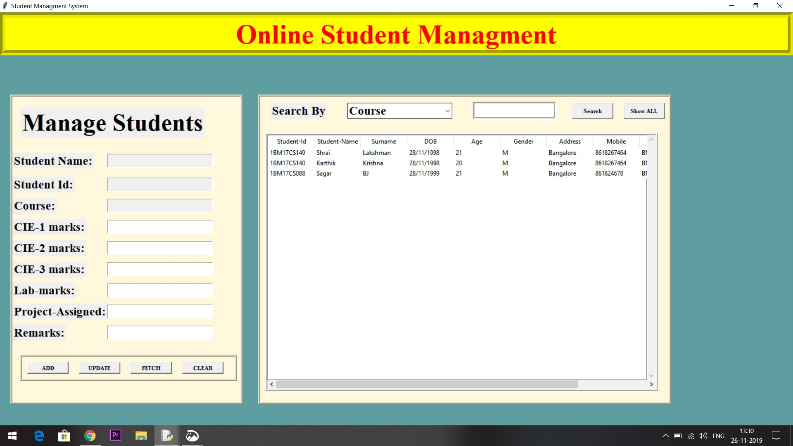

# Python-Project

## Online Student Managment Application

>Designing an Student Managment Application which reduces the time lost in keeping track of student activities. 

### USERS
* **PROCTOR/MENTOR**
* **STUDENT**

### FUNCTIONALITY
* **PROCTOR/MENTOR**
1)ADD/REMOVE STUDENTS
2)ADD MARKS/LAB MARKS/ASSIGN PROJECTS/REMARKS

* **STUDENT**
1)REGISTERATION
2)CHECK INFORMATION

>OVERVIEW   

  

